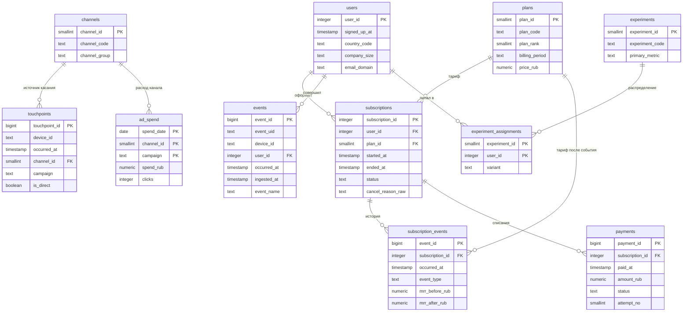

# Модель данных

Два слоя. **`app`** — сырые данные, как их отдала бы продакшн-база и трекер
событий. **`marts`** — витрины, на которые смотрит аналитик. Аналитические
запросы обращаются только к `marts`; каждое обращение к `app` из запроса —
повод спросить, почему нужного поля нет в витрине.

## Схема `app`



Между `touchpoints` и `users` связи НЕТ, и это не упущение. Касание происходит
до регистрации, когда аккаунта ещё не существует, — его можно привязать только
к устройству. Восстановить цепочку «касание → устройство → аккаунт» приходится
запросом, и получается это не всегда.


### Зерно таблиц

| Таблица | Одна строка — это | Объём |
|---|---|---|
| `users` | зарегистрированный пользователь | ~12 000 |
| `subscriptions` | подписка, включая не дожившие до оплаты триалы | ~12 000 |
| `subscription_events` | изменение состояния подписки | ~25 000 |
| `payments` | попытка списания (успешная, неуспешная или возврат) | ~12 000 |
| `touchpoints` | маркетинговое касание на устройстве до регистрации | ~40 000 |
| `ad_spend` | расход за день по каналу и кампании | ~5 500 |
| `events` | доставленная запись о действии (с дублями и анонимными) | ~450 000 |
| `experiment_assignments` | попадание пользователя в вариант эксперимента | ~3 200 |

### Чего в данных нет и почему это главное

**Канала привлечения у пользователя нет.** В момент клика по рекламе аккаунта
не существует — есть устройство. Всё, что остаётся, это касания
(`app.touchpoints`), привязанные к устройству, и события, часть которых тоже
анонимна. Цепочку «касание → устройство → аккаунт» собирает
`marts.stg_identity`, а канал выводит `marts.stg_attribution`. Примерно у
четверти регистраций не выводится ничего: заблокированы куки, потерялись метки
на редиректе, переход пришёл из мессенджера.

**Стоимости привлечения в справочнике нет.** Расходы приходят из рекламных
кабинетов суточными строками по кампаниям (`app.ad_spend`). Связать их с
пользователями можно только агрегатами по периоду и каналу — кабинет не знает,
кто именно зарегистрировался.

**Причины отмены нет у большинства ушедших.** Пассивный отток (не прошло
списание) её не имеет в принципе, а из отменивших сознательно форму заполняет
меньше половины. То, что заполняют, приходит в произвольном виде.

### Пять дефектов в выгрузке

Сырой слой намеренно грязный — ровно так, как приходят данные в жизни. Разбор
в `marts.stg_*`, измерение масштаба — в `sql/analysis/00_data_hygiene.sql`.

| Дефект | Как выглядит | Где чинится |
|---|---|---|
| Дубли ретраев | разные `event_id`, один `event_uid` | дедупликация в `stg_events` |
| Анонимные сессии | `user_id` пуст, есть `device_id` | склейка через `stg_identity` |
| Боты и случайные посетители | устройство без единого входа в аккаунт | отсекаются отсутствием владельца |
| Служебные аккаунты | домен почты компании | фильтр по `email_domain` |
| Переименованное событие | `task_create` вместо `task_created` в окне релиза | склейка имён в `stg_events` |

Отдельно стоит **задержка доставки**: `ingested_at` отличается от
`occurred_at` на секунды у 91 % событий и на сутки с лишним примерно у одного
процента. Это не дефект и не чинится — с этим работают явно, иначе отчёт за
период, построенный сразу после его окончания, не сойдётся с собой же через
неделю.

### Три места, где легко ошибиться

**`subscriptions.plan_id` — текущий тариф, а не тариф на момент оплаты.**
Считать по нему выручку прошлых месяцев нельзя: апгрейд перепишет историю
задним числом. Тариф на момент конверсии берётся из `subscription_events`.

**MRR нормирован к месяцу.** У годовой подписки в `mrr_after_rub` лежит
двенадцатая часть годовой цены, иначе помесячная динамика прыгала бы на порядок
в месяцы годовых списаний. Фактическое списание — в `payments.amount_rub`, и
оно отличается от MRR в двенадцать раз.

**У одного пользователя может быть несколько подписок.** Примерно 9 % ушедших
возвращаются позже. Поэтому `count(*) FROM subscriptions` больше, чем число
пользователей, а в водопаде MRR вторая подписка попадает в `reactivation`, а не
в `new`.

## Схема `marts`

| Витрина | Зерно | Зачем |
|---|---|---|
| `meta` | одна строка | момент выгрузки данных |
| `stg_identity` | устройство | связь устройства с аккаунтом |
| `stg_events` | событие | чистый лог: склейка, дедупликация, отсев ботов и служебных |
| `stg_attribution` | пользователь | канал по двум моделям атрибуции |
| `dim_date` | день | календарь без пропусков |
| `dim_user` | пользователь | когорта, канал, воронка, флаги активации и конверсии |
| `fct_subscription` | подписка | срок жизни, первый и текущий MRR, собранная выручка |
| `fct_mrr_movement` | изменение MRR | водопад: new / reactivation / expansion / contraction / churn |
| `fct_subscription_month` | подписка × месяц | MRR на конец месяца, для когортного NRR |
| `fct_user_activity_daily` | пользователь × день | свёрнутый лог событий |
| `fct_user_activity_week` | пользователь × неделя жизни | кривые удержания |

Порядок сборки задан именами файлов: `00_schema` → `01_stg_identity` →
`02_stg_events` → `03_stg_attribution` → `05_stats` → `10_dim_user` → … Витрины выше по течению читают `stg_events`, а
не `app.events`: чистка выполняется один раз, и ни один отчёт не может её
случайно пропустить.

Все витрины материализованы. На таком объёме обычные представления работали бы
не сильно медленнее, но материализация фиксирует результат: два запроса в одном
отчёте гарантированно видят одни и те же числа.

### `marts.snapshot_ts()` и почему не `now()`

Дата среза выводится из данных (`max(occurred_at)` в `app.events`), а не из
текущего времени. Иначе одни и те же запросы завтра дадут другие числа, и
проверить кейс станет невозможно.

Функция читает материализованную витрину `marts.meta` из одной строки, а не
считает максимум сама. Причина в том, как PostgreSQL выполняет `STABLE`-функции:
в списке выборки такая функция вычисляется на **каждой строке**. Версия, которая
честно считала `max(occurred_at)` внутри себя, превращала построение `dim_user`
в 12 тысяч полных проходов по 440 тысячам событий — запрос не завершался.

Разница измерена: **10 155 мс против 2,8 мс** на выборке из 200 пользователей,
то есть в 3 700 раз. Планы и методика — в [performance.md](performance.md).

### Определения, заданные в одном месте

Активация задана в `marts.dim_user.is_activated` и нигде больше не повторяется:

```sql
(first_project_at IS NOT NULL AND tasks_first_7d >= 3)
```

Зрелость наблюдения — в `marts.dim_user.is_matured`: зарегистрировался раньше
чем за 30 дней до среза, то есть успел пройти четырнадцатидневный триал и
принять решение. Все запросы, считающие конверсию, фильтруют по этому полю.
Без него конверсия последних недель занижена механически: люди ещё внутри
триала, а в знаменатель уже попали.
