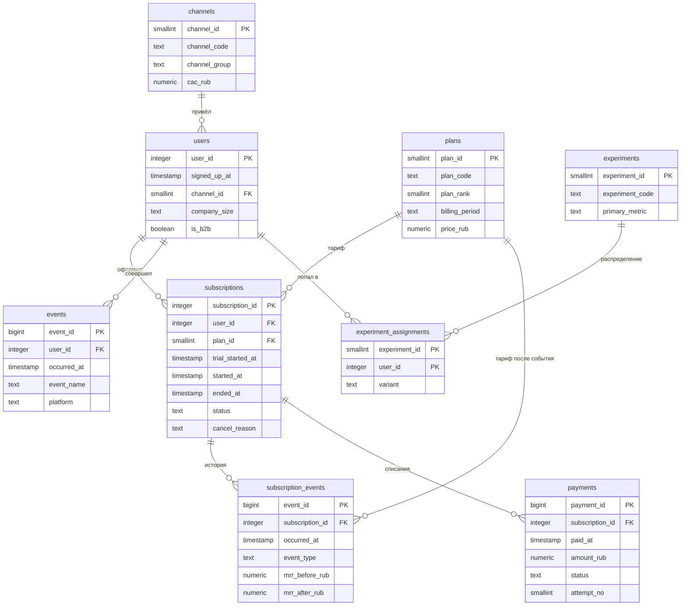

# Модель данных

Два слоя. **`app`** — сырые данные, как их отдала бы продакшн-база и трекер
событий. **`marts`** — витрины, на которые смотрит аналитик. Аналитические
запросы обращаются только к `marts`; каждое обращение к `app` из запроса —
повод спросить, почему нужного поля нет в витрине.

## Схема `app`



### Зерно таблиц

| Таблица | Одна строка — это | Объём |
|---|---|---|
| `users` | зарегистрированный пользователь | ~12 000 |
| `subscriptions` | подписка, включая не дожившие до оплаты триалы | ~12 000 |
| `subscription_events` | изменение состояния подписки | ~25 000 |
| `payments` | попытка списания (успешная, неуспешная или возврат) | ~12 000 |
| `events` | действие пользователя в продукте | ~400 000 |
| `experiment_assignments` | попадание пользователя в вариант эксперимента | ~3 200 |

### Три места, где легко ошибиться

**`subscriptions.plan_id` — текущий тариф, а не тариф на момент оплаты.**
Считать по нему выручку прошлых месяцев нельзя: апгрейд перепишет историю
задним числом. Тариф на момент конверсии берётся из `subscription_events`.

**MRR нормирован к месяцу.** У годовой подписки в `mrr_after_rub` лежит
двенадцатая часть годовой цены, иначе помесячная динамика прыгала бы на порядок
в месяцы годовых списаний. Фактическое списание — в `payments.amount_rub`, и
оно отличается от MRR в двенадцать раз.

**У одного пользователя может быть несколько подписок.** Примерно 9 % ушедших
возвращаются позже. Поэтому `count(*) FROM subscriptions` больше, чем число
пользователей, а в водопаде MRR вторая подписка попадает в `reactivation`, а не
в `new`.

## Схема `marts`

| Витрина | Зерно | Зачем |
|---|---|---|
| `meta` | одна строка | момент выгрузки данных |
| `dim_date` | день | календарь без пропусков |
| `dim_user` | пользователь | когорта, канал, воронка, флаги активации и конверсии |
| `fct_subscription` | подписка | срок жизни, первый и текущий MRR, собранная выручка |
| `fct_mrr_movement` | изменение MRR | водопад: new / reactivation / expansion / contraction / churn |
| `fct_subscription_month` | подписка × месяц | MRR на конец месяца, для когортного NRR |
| `fct_user_activity_daily` | пользователь × день | свёрнутый лог событий |
| `fct_user_activity_week` | пользователь × неделя жизни | кривые удержания |

Все витрины материализованы. На таком объёме обычные представления работали бы
не сильно медленнее, но материализация фиксирует результат: два запроса в одном
отчёте гарантированно видят одни и те же числа.

### `marts.snapshot_ts()` и почему не `now()`

Дата среза выводится из данных (`max(occurred_at)` в `app.events`), а не из
текущего времени. Иначе одни и те же запросы завтра дадут другие числа, и
проверить кейс станет невозможно.

Функция читает материализованную витрину `marts.meta` из одной строки, а не
считает максимум сама. Причина в том, как PostgreSQL выполняет `STABLE`-функции:
в списке выборки такая функция вычисляется на **каждой строке**. Версия, которая
честно считала `max(occurred_at)` внутри себя, превращала построение `dim_user`
в 12 тысяч полных проходов по 400 тысячам событий — запрос не завершался.

### Определения, заданные в одном месте

Активация задана в `marts.dim_user.is_activated` и нигде больше не повторяется:

```sql
(first_project_at IS NOT NULL AND tasks_first_7d >= 3)
```

Зрелость наблюдения — в `marts.dim_user.is_matured`: зарегистрировался раньше
чем за 30 дней до среза, то есть успел пройти четырнадцатидневный триал и
принять решение. Все запросы, считающие конверсию, фильтруют по этому полю.
Без него конверсия последних недель занижена механически: люди ещё внутри
триала, а в знаменатель уже попали.
